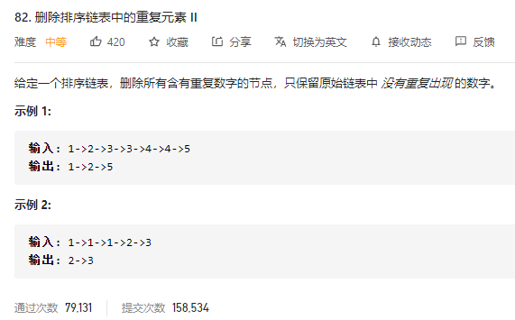

### leetcode_82_medium_删除排序链表中的重复元素Ⅱ



```c++
/**
 * Definition for singly-linked list.
 * struct ListNode {
 *     int val;
 *     ListNode *next;
 *     ListNode(int x) : val(x), next(NULL) {}
 * };
 */
class Solution {
public:
    ListNode* deleteDuplicates(ListNode* head) {
        
    }
};
```

#### 算法思路

要解决的问题是，如何判断节点是含有重复数字的。解决方法是：

- 引入计数器count，判断当前数字出现了多少次。
- 引入formerVal，记录上一个出现的数字，用于判断和当前数字是否相同
- 每当访问到一个不同的元素，判断能否把上一个元素加入结果链表(即，count是否为1)
- 注意，对于升序链表的最后一个节点，需要再讨论一次

另外，可以引入**结果链表头结点的前驱结点**pPreHead，简化运算

```c++
class Solution {
public:
	ListNode* deleteDuplicates(ListNode* head) {
		int count, formerVal;
		ListNode* pPreHead = new ListNode(0);  //结果链表头结点之前的一个元素
		ListNode* pCur, *pResCur;

		if (head == nullptr)
			return nullptr;
		pCur = head;  //指向排序链表当前待访问的元素
		pResCur = pPreHead;  //指向结果链表已访问的最后一个元素
		formerVal = pCur->val - 1;  //前驱节点的值。初始化为和head->val不同即可
		count = 0;
		//处理前n-1个节点
		while (pCur != nullptr)
		{
			if (pCur->val != formerVal)  //访问到了新的值
			{
				if (count == 1)  //数字仅出现了一次
				{
					pResCur->next = new ListNode(formerVal);
					pResCur = pResCur->next;
				}
				count = 1;
				formerVal = pCur->val;
			}
			else  //访问到的值和上次一样
			{
				count++;
			}
			pCur = pCur->next;
		}
		//单独处理最后一个节点
		if (count == 1)
			pResCur->next = new ListNode(formerVal);
		//处理并返回结果
		pResCur = pPreHead->next;
		delete pPreHead;
		return pResCur;
	}
};
```

