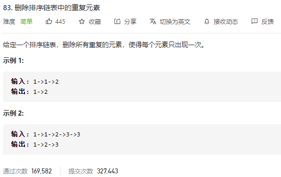

### leetcode_83_easy_删除排序链表中的重复元素



```c++
class Solution {
public:
    ListNode* deleteDuplicates(ListNode* head) {
        
    }
};
```

#### 算法思路

遍历升序数组，每一个元素都试着加入结果链表。如果没有重复，则成功加入

```c++
class Solution {
public:
	ListNode* deleteDuplicates(ListNode* head) {
		ListNode* pCur, *pResCur, *pResHead;

		if (head == nullptr)
			return nullptr;
		pCur = head;
		pResHead = new ListNode(pCur->val);
		pResCur = pResHead;
		while (pCur != nullptr)
		{
			if (pCur->val != pResCur->val)  //如果找到了新元素，则加入结果链表
			{
				pResCur->next = new ListNode(pCur->val);
				pResCur = pResCur->next;
			}
			pCur = pCur->next;
		}
		return pResHead;
	}
};
```

