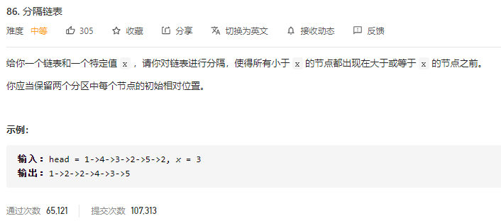

### leetcode_86_medium_分隔链表



```c++
/**
 * Definition for singly-linked list.
 * struct ListNode {
 *     int val;
 *     ListNode *next;
 *     ListNode(int x) : val(x), next(NULL) {}
 * };
 */
class Solution {
public:
    ListNode* partition(ListNode* head, int x) {
        
    }
};
```

#### 移动节点

维护两个指针。

- 指针pCur，用于向后访问，遍历每个元素，找到小于x的元素。pCur指向已经处理过的最后一个元素
- 指针，pResCur，用于指引应该将小于x的元素插入到什么位置。总是将小于x的元素 插到pResCur的后面

则算法步骤为：

1. 扫描链表，找到第一个>=x的元素。将pCur定位到此处。在此处之后，所有<x的元素，都要放到此处之前。特殊情况是，如果找不到>=x的元素，那就意味着所有链表元素都<x，无需移动任何链表元素
2. 对于上述pCur，向后扫描。
   - 如果pCur->next->val<x，则需要把这个元素移动到前面，也就是pResCur指针的后面
   - 如果pCur->next->val>=x，则pCur后面的元素无需任何操作。直接向后迭代即可。

```c++
class Solution {
public:
	ListNode* partition(ListNode* head, int x) {
		ListNode *pCur, *pResCur, *pTemp;
		ListNode *pPreHead;

		pPreHead = new ListNode(INT_MIN);
		pPreHead->next = head;
		//pCur的初始位置，移动到第一个满足pCur->val>=x的地方
		pCur = head;
		pResCur = pPreHead;
		while (pCur&&pCur->val < x)
		{
			pCur = pCur->next;
			pResCur = pResCur->next;
		}
		if (pCur == nullptr)  //如果全都小于x，则无需移动
			return head;
		//将pCur之后的每一个小于x的节点 移动到pCur之前
		while (pCur&&pCur->next)
		{
			if (pCur->next->val < x)  //找到小于x的元素，则将其移动到前面
			{
				pTemp = pResCur->next;
				pResCur->next = pCur->next;  //将节点移动到x之前
				pCur->next = pCur->next->next;  //断开与原位置的连接
				pResCur->next->next = pTemp;  //将节点移动到x之前
				pResCur = pResCur->next;
			}
			else
				pCur = pCur->next;
		}

		pTemp = pPreHead->next;
		delete pPreHead;
		return pTemp;
	}
};
```

#### 两个子链表

维护两个子链表，lower,higher。将不同大小的节点，分别粘到这两个子链表处。最后连接这两个子链表


```c++
class Solution {
public:
	ListNode* partition(ListNode* head, int x) {
		ListNode* lowerHead = new ListNode(-1), * higherHead = new ListNode(-1), * lowerCur, * higherCur, * cur;
		//分为<x,>=x两个子链表 
		cur = head;
		lowerCur = lowerHead;
		higherCur = higherHead;
		while (cur)
		{
			if (cur->val < x)
			{
				lowerCur->next = cur;
				lowerCur = cur;
			}
			else
			{
				higherCur->next = cur;
				higherCur = cur;
			}
			cur = cur->next;
		}
		lowerCur->next = nullptr;
		higherCur->next = nullptr;
		//链接两个子链表
		if(higherHead->next)
			lowerCur->next = higherHead->next;
		//返回
		if (lowerHead->next)
			return lowerHead->next;
		else
			return nullptr;
	}
};
```

