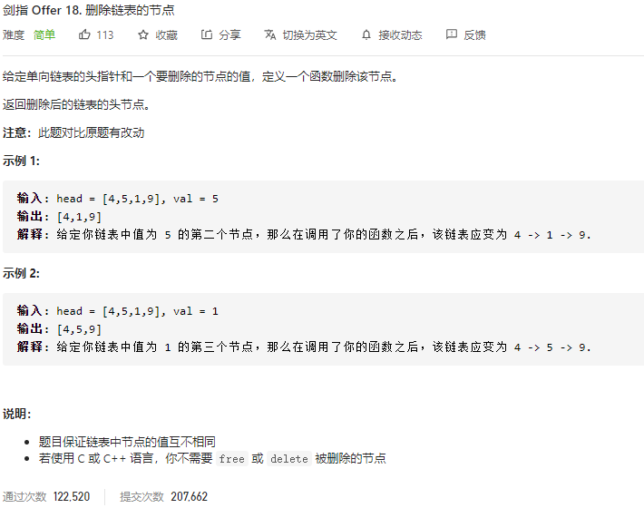

### 剑指offer_18_easy_删除链表的节点



```c++
/**
 * Definition for singly-linked list.
 * struct ListNode {
 *     int val;
 *     ListNode *next;
 *     ListNode(int x) : val(x), next(NULL) {}
 * };
 */
class Solution {
public:
    ListNode* deleteNode(ListNode* head, int val) {

    }
};
```

#### 算法思路

```c++
class Solution {
public:
    ListNode* deleteNode(ListNode* head, int val) {
        ListNode *cur;

        //特殊情况
        if(head==nullptr)
            return nullptr;
        else if(head->val==val)
            return head->next;
        //一般情况
        cur=head;
        while(cur->next)
        {
            if(cur->next->val==val)
            {
                cur->next=cur->next->next;
                break;
            }
            cur=cur->next;
        }
        return head;
    }
};
```

