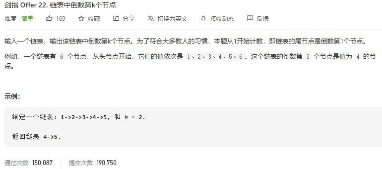

### 剑指offer_22_easy_链表中倒数第k个节点



```c++
class Solution {
public:
    ListNode* getKthFromEnd(ListNode* head, int k) {

    }
};
```

#### 算法思路

快慢指针 快指针先走k步

```c++
class Solution {
public:
    ListNode* getKthFromEnd(ListNode* head, int k) {
        ListNode *fast,*slow;

        fast=head;
        slow=head;
        while(k>0)
        {
            fast=fast->next;
            --k;
        }
        while(fast)
        {
            fast=fast->next;
            slow=slow->next;
        }
        return slow;
    }
};
```

