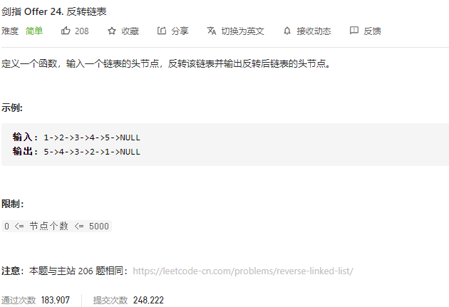

### 剑指offer_24_easy_翻转链表



```c++
class Solution {
public:
    ListNode* reverseList(ListNode* head) {

    }
};
```

#### 算法思路

同 leetcode_206_easy_反转链表

```c++
class Solution {
public:
    ListNode* reverseList(ListNode* head) {
        ListNode *former,*cur,*nxt;

        former=nullptr;
        cur=head;
        while(cur!=nullptr)
        {
            nxt=cur->next;
            cur->next=former;
            former=cur;
            cur=nxt;
        }
        return former;
    }
};
```

