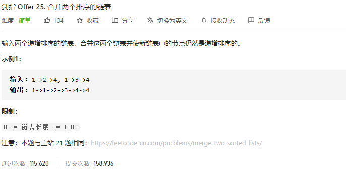

### 剑指offer_25_easy_合并两个排序的链表



```c++
class Solution {
public:
    ListNode* mergeTwoLists(ListNode* l1, ListNode* l2) {

    }
};
```

#### 算法思路

同 leetcode_21_medium_合并两个有序链表

```c++
class Solution {
public:
	ListNode* mergeTwoLists(ListNode* l1, ListNode* l2) {
		ListNode *cur;
		ListNode dummyHeadNode(-1);
		ListNode *dummyHead = &dummyHeadNode;

		cur = dummyHead;
		while (l1&&l2)
		{
			if (l1->val < l2->val)
			{
				cur->next = l1;
				l1 = l1->next;
                cur=cur->next;
			}
			else
			{
				cur->next = l2;
				l2 = l2->next;
                cur=cur->next;
			}
		}
		if (l1)
			cur->next = l1;
		if (l2)
			cur->next = l2;
		return dummyHead->next;
	}
};
```

